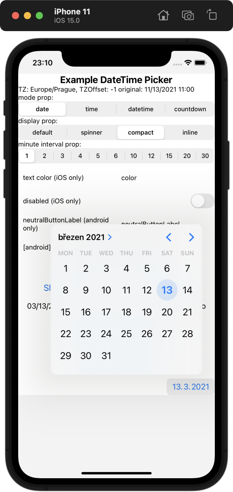

# 🚧🚧 Looking for collaborators and financial backers 🚧🚧

Please support maintenance of the module with a monthly donation or help us with issues and pull requests.

[Become a backer on OpenCollective](https://opencollective.com/react-native-datetimepicker) or [sponsor us on GitHub Sponsors](https://github.com/sponsors/react-native-datetimepicker).

See this [issue](https://github.com/react-native-datetimepicker/datetimepicker/issues/313) for context. Thank you!

<a href="https://opencollective.com/react-native-datetimepicker/donate" target="_blank">
  
</a>

<br>
<br>
<br>
<br>
<br>
<br>
<br>
<br>
<br>
<br>
<br>
<br>
<br>
<br>

---

## React Native DateTimePicker

This repository was moved out of the react native community GH organization, in accordance to [this proposal](https://github.com/react-native-community/discussions-and-proposals/issues/176).
The module is still published on `npm` under the old namespace (as documented) but will be published under a new namespace at some point, with a major version bump.

![CircleCI Status][circle-ci-status]
![Supports Android and iOS][support-badge]
![MIT License][license-badge]
[![Lean Core Badge][lean-core-badge]][lean-core-issue]

React Native date & time picker component for iOS, Android and Windows (please note Windows is not actively maintained).

## Screenshots

<details>
  <summary>Expand for screenshots</summary>

<table>
  <tr><td colspan=2><strong>iOS</strong></td></tr>
  <tr>
    <td><p align="center"></p></td>
    <td><p align="center"></p></td>
  </tr>
  <tr><td colspan=2><strong>Android</strong></td></tr>
  <tr>
    <td><p align="center"></p></td>
    <td><p align="center"></p></td>
  </tr>
  <tr><td colspan=1><strong>Windows</strong></td></tr>
  <tr>
    <td><p align="center"></p></td>
    <td><p align="center"></p></td>
  </tr>
  <tr>
    <td><p align="center"></p></td>
  </tr>
</table>

</details>

## Table of contents

- [React Native DateTimePicker](#react-native-datetimepicker)
  - [Table of contents](#table-of-contents)
  - [Expo users notice](#expo-users-notice)
  - [Getting started](#getting-started)
  - [Usage](#usage)
  - [React Native Support](#react-native-support)
  - [Localization note](#localization-note)
  - [Android imperative API](#android-imperative-api)
  - [Android styling](#android-styling)
  - [Props / params](#component-props--params-of-the-android-imperative-api)
    - [`mode` (`optional`)](#mode-optional)
    - [`display` (`optional`)](#display-optional)
    - [`onChange` (`optional`)](#onchange-optional)
    - [`value` (`required`)](#value-required)
    - [`maximumDate` (`optional`)](#maximumdate-optional)
    - [`minimumDate` (`optional`)](#minimumdate-optional)
    - [`timeZoneName` (`optional`, `iOS or Android only`)](#timeZoneName-optional-ios-and-android-only)
    - [`timeZoneOffsetInMinutes` (`optional`, `iOS or Android only`)](#timezoneoffsetinminutes-optional-ios-and-android-only)
    - [`timeZoneOffsetInSeconds` (`optional`, `Windows only`)](#timezoneoffsetinsecond-optional-windows-only)
    - [`dayOfWeekFormat` (`optional`, `Windows only`)](#dayOfWeekFormat-optional-windows-only)
    - [`dateFormat` (`optional`, `Windows only`)](#dateFormat-optional-windows-only)
    - [`firstDayOfWeek` (`optional`, `Windows only`)](#firstDayOfWeek-optional-windows-only)
    - [`textColor` (`optional`, `iOS only`)](#textColor-optional-ios-only)
    - [`accentColor` (`optional`, `iOS only`)](#accentColor-optional-ios-only)
    - [`themeVariant` (`optional`, `iOS only`)](#themevariant-optional-ios-only)
    - [`locale` (`optional`, `iOS only`)](#locale-optional-ios-only)
    - [`is24Hour` (`optional`, `Windows and Android only`)](#is24hour-optional-windows-and-android-only)
    - [`positiveButton` (`optional`, `Android only`)](#positiveButton-optional-android-only)
    - [`negativeButton` (`optional`, `Android only`)](#negativeButton-optional-android-only)
    - [`neutralButton` (`optional`, `Android only`)](#neutralButton-optional-android-only)
    - [`minuteInterval` (`optional`)](#minuteinterval-optional)
    - [`style` (`optional`, `iOS only`)](#style-optional-ios-only)
    - [`disabled` (`optional`, `iOS only`)](#disabled-optional-ios-only)
    - [`view props` (`optional`, `iOS only`)](#view-props-optional-ios-only)
    - [`onError` (`optional`, `Android only`)](#onError-optional-android-only)
  - [Testing with Jest](#testing-with-jest)
  - [Migration from the older components](#migration-from-the-older-components)
  - [Contributing to the component](#contributing-to-the-component)
  - [Manual installation](#manual-installation)
  - [Running the example app](#running-the-example-app)

## Requirements

- Only Android API level >=21 (Android 5), iOS >= 11 are supported.
- Tested with Xcode 14.0 and RN 0.72.7. Other configurations are very likely to work as well but have not been tested.

The module supports the [new React Native architecture](https://reactnative.dev/docs/next/the-new-architecture/why) (Fabric rendering of iOS components, and turbomodules on Android). If you are using the new architecture, you will need to use React Native 0.71.4 or higher.

## Expo users notice

This module is part of Expo Managed Workflow - [see docs](https://docs.expo.io/versions/latest/sdk/date-time-picker/). However, Expo SDK in the Managed Workflow may not contain the latest version of the module and therefore, the newest features and bugfixes may not be available in Expo Managed Workflow.
If you use the Managed Workflow, use the command `expo install @react-native-community/datetimepicker` (not `yarn` or `npm`) to install this module - Expo will automatically install the latest version compatible with your Expo SDK (which may _not_ be the latest version of the module available).

If you're using a [Dev Client](https://docs.expo.dev/development/create-development-builds/), rebuild the Dev Client after installing the dependencies.

If you're using the [`expo prebuild`](https://docs.expo.dev/workflow/prebuild/) command and building your native app projects (e.g. with EAS Build or locally), you can use the latest version of the module.

## Getting started

```bash
npm install @react-native-community/datetimepicker --save
```

or

```bash
yarn add @react-native-community/datetimepicker
```

Autolinking is not yet implemented on Windows, so [manual installation ](/docs/manual-installation.md) is needed.

#### RN >= 0.60

If you are using RN >= 0.60, only run `npx pod-install`. Then rebuild your project.

## React Native Support

Check the `react-native` version support table below to find the corresponding `datetimepicker` version to meet support requirements.

| react-native version | version |
| -------------------- | ------- |
| 0.73.0+              | 7.6.3+  |
| <=0.72.0             | <=7.6.2 |
| 0.70.0+              | 7.0.1+  |
| <0.70.0              | <=7.0.0 |

## Usage

```js
import DateTimePicker from '@react-native-community/datetimepicker';
```

<details>
  <summary>Expand for examples</summary>

We give two equivalent examples on how to use the package on all supported platforms.

### Recommended imperative api usage on Android

While the component-approach as given in the second paragraph works on Android, the recommended approach is to use the imperative api given in the first paragraph.

Read more about the motivation in [Android imperative API](#android-imperative-api).

```js
export const App = () => {
  const [date, setDate] = useState(new Date(1598051730000));

  const onChange = (event, selectedDate) => {
    const currentDate = selectedDate;
    setDate(currentDate);
  };

  const showMode = (currentMode) => {
    DateTimePickerAndroid.open({
      value: date,
      onChange,
      mode: currentMode,
      is24Hour: true,
    });
  };

  const showDatepicker = () => {
    showMode('date');
  };

  const showTimepicker = () => {
    showMode('time');
  };

  return (
    <SafeAreaView>
      <Button onPress={showDatepicker} title="Show date picker!" />
      <Button onPress={showTimepicker} title="Show time picker!" />
      <Text>selected: {date.toLocaleString()}</Text>
    </SafeAreaView>
  );
};
```

### Component usage on iOS / Android / Windows

```js
export const App = () => {
  const [date, setDate] = useState(new Date(1598051730000));
  const [mode, setMode] = useState('date');
  const [show, setShow] = useState(false);

  const onChange = (event, selectedDate) => {
    const currentDate = selectedDate;
    setShow(false);
    setDate(currentDate);
  };

  const showMode = (currentMode) => {
    setShow(true);
    setMode(currentMode);
  };

  const showDatepicker = () => {
    showMode('date');
  };

  const showTimepicker = () => {
    showMode('time');
  };

  return (
    <SafeAreaView>
      <Button onPress={showDatepicker} title="Show date picker!" />
      <Button onPress={showTimepicker} title="Show time picker!" />
      <Text>selected: {date.toLocaleString()}</Text>
      {show && (
        <DateTimePicker
          testID="dateTimePicker"
          value={date}
          mode={mode}
          is24Hour={true}
          onChange={onChange}
        />
      )}
    </SafeAreaView>
  );
};
```

</details>

## Localization note

By localization, we refer to the language (names of months and days), as well as order in which date can be presented in a picker (month/day vs. day/month) and 12 / 24 hour-format.

On Android, the picker will be controlled by the system locale. If you wish to change it, [see instructions here](https://developer.android.com/guide/topics/resources/app-languages).

On iOS, use XCode, as [documented here](https://developer.apple.com/documentation/xcode/adding-support-for-languages-and-regions) to inform the OS about the locales your application supports. iOS will automatically display the correctly localized DateTimePicker as long as the target language is contained in `project.pbxproj`.

> If you use a library like [i18next](https://github.com/i18next/react-i18next) or [react-localize-redux](https://github.com/ryandrewjohnson/react-localize-redux) to manage your translations, it is sufficient to add your target languages as described in the Apple Documentation - but you are not required to add any localization keys (like, for example, the days of the week). iOS will automatically display the correct localized strings as long as the target language is contained in `project.pbxproj`.

For testing your localization setup, refer [here](https://developer.apple.com/documentation/xcode/testing-localizations-when-running-your-app).

There is also the iOS-only locale prop that can be used to force locale in some cases but its usage is discouraged due to [not working robustly in all picker modes](./docs/images/ios_date_new.png) (note the mixed month and day names). To the best of our knowledge, it works reliably in the `spinner` mode.

For Expo, follow the [localization docs](https://docs.expo.dev/distribution/app-stores/#localizing-your-ios-app).

### Android imperative api

On Android, you have a choice between using the component API (regular React component) or an imperative api (think of something like `ReactNative.alert()`).

While the component API has the benefit of writing the same code on all platforms, for start we recommend using the imperative API on Android.

The `params` is an object with the same properties as the component props documented in the next paragraph. (This is also because the component api internally uses the imperative one.)

```ts
import { DateTimePickerAndroid } from '@react-native-community/datetimepicker';

DateTimePickerAndroid.open(params: AndroidNativeProps)
DateTimePickerAndroid.dismiss(mode: AndroidNativeProps['mode'])
```

The reason we recommend the imperative API is: on Android, the date/time picker opens in a dialog, similar to `ReactNative.alert()` from core react native. The imperative api models this behavior better than the declarative component api. While the component approach is perfectly functional, based on the issue tracker history, it appears to be more prone to introducing bugs.

### Android styling

Styling of the dialogs on Android can be easily customized by using the provided config plugin, provided that you use a [Expo development build](https://docs.expo.dev/develop/development-builds/introduction/). The plugin allows you to configure color properties that cannot be set at runtime and requires building a new app binary to take effect.

Refer to this documentation for more information: [android-styling.md](/docs/android-styling.md).

## Component props / params of the Android imperative api

> Please note that this library currently exposes functionality from [`UIDatePicker`](https://developer.apple.com/documentation/uikit/uidatepicker?language=objc) on iOS and [DatePickerDialog](https://developer.android.com/reference/android/app/DatePickerDialog) + [TimePickerDialog](https://developer.android.com/reference/android/app/TimePickerDialog) on Android, and [`CalendarDatePicker`](https://docs.microsoft.com/en-us/windows/uwp/design/controls-and-patterns/calendar-date-picker) + [TimePicker](https://docs.microsoft.com/en-us/uwp/api/windows.ui.xaml.controls.timepicker?view=winrt-19041) on Windows.
>
> These native classes offer only limited configuration, while there are dozens of possible options you as a developer may need. It follows that if your requirement is not supported by the backing native views, this library will _not_ be able to implement your requirement. When you open an issue with a feature request, please document if (or how) the feature can be implemented using the aforementioned native views. If the native views do not support what you need, such feature requests will be closed as not actionable.

#### `mode` (`optional`)

Defines the type of the picker.

List of possible values:

- `"date"` (default for `iOS` and `Android` and `Windows`)
- `"time"`
- `"datetime"` (`iOS` only)
- `"countdown"` (`iOS` only)

```js
<RNDateTimePicker mode="time" />
```

#### `display` (`optional`)

Defines the visual display of the picker. The default value is `"default"`.

List of possible values for Android

- `"default"` - Recommended. Show a default date picker (spinner/calendar/clock) based on `mode`.
- `"spinner"`
- `"calendar"` (only for `date` mode)
- `"clock"` (only for `time` mode)

List of possible values for iOS (maps to [preferredDatePickerStyle](https://developer.apple.com/documentation/uikit/uidatepicker/3526124-preferreddatepickerstyle?changes=latest_minor&language=objc))

- `"default"` - Automatically pick the best style available for the current platform & mode.
- `"spinner"` - the usual pre-iOS 14 appearance with a wheel from which you choose values
- `"compact"` - Affects only iOS 14 and later. Will fall back to "spinner" if not supported.
- `"inline"` - Affects only iOS 14 and later. Will fall back to "spinner" if not supported.

```js
<RNDateTimePicker display="spinner" />
```

#### `onChange` (`optional`)

Date change handler.

This is called when the user changes the date or time in the UI. It receives the event and the date as parameters.
It is also called when user dismisses the picker, which you can detect by checking the `event.type` property.
The values can be: `'set' | 'dismissed' | 'neutralButtonPressed'`. (`neutralButtonPressed` is only available on Android).

The `utcOffset` field is only available on Android and iOS. It is the offset in minutes between the selected date and UTC time.

```js
const setDate = (event: DateTimePickerEvent, date: Date) => {
  const {
    type,
    nativeEvent: {timestamp, utcOffset},
  } = event;
};

<RNDateTimePicker onChange={this.setDate} />;
```

#### `value` (`required`)

Defines the date or time value used in the component.

```js
<RNDateTimePicker value={new Date()} />
```

#### `maximumDate` (`optional`)

Defines the maximum date that can be selected. Note that on Android, this only works for `date` mode because [TimePicker](https://developer.android.com/reference/android/widget/TimePicker) does not support this.

```js
<RNDateTimePicker maximumDate={new Date(2030, 10, 20)} />
```

#### `minimumDate` (`optional`)

Defines the minimum date that can be selected. Note that on Android, this only works for `date` mode because [TimePicker](https://developer.android.com/reference/android/widget/TimePicker) does not support this.

```js
<RNDateTimePicker minimumDate={new Date(1950, 0, 1)} />
```

#### `timeZoneName` (`optional`, `iOS and Android only`)

Allows changing of the time zone of the date picker. By default, it uses the device's time zone.
Use the time zone name from the IANA (TZDB) database name in https://en.wikipedia.org/wiki/List_of_tz_database_time_zones.

```js
<RNDateTimePicker timeZoneName={'Europe/Prague'} />
```

#### `timeZoneOffsetInMinutes` (`optional`, `iOS and Android only`)

Allows changing of the time zone of the date picker. By default, it uses the device's time zone.
We **strongly** recommend using `timeZoneName` prop instead; this prop has known issues in the android implementation (eg. [#528](https://github.com/react-native-datetimepicker/datetimepicker/issues/528)).

This prop will be removed in a future release.

```js
// GMT+1
<RNDateTimePicker timeZoneOffsetInMinutes={60} />
```

#### `timeZoneOffsetInSeconds` (`optional`, `Windows only`)

Allows changing of the time zone of the date picker. By default, it uses the device's time zone.

```js
// UTC+1
<RNDateTimePicker timeZoneOffsetInSeconds={3600} />
```

#### `dayOfWeekFormat` (`optional`, `Windows only`)

Sets the display format for the day of the week headers.
Reference: https://docs.microsoft.com/en-us/uwp/api/windows.ui.xaml.controls.calendarview.dayofweekformat?view=winrt-18362#remarks

```js
<RNDateTimePicker dayOfWeekFormat={'{dayofweek.abbreviated(2)}'} />
```

#### `dateFormat` (`optional`, `Windows only`)

Sets the display format for the date value in the picker's text box.
Reference: https://docs.microsoft.com/en-us/uwp/api/windows.globalization.datetimeformatting.datetimeformatter?view=winrt-18362#examples

```js
<RNDateTimePicker dateFormat="dayofweek day month" />
```

#### `firstDayOfWeek` (`optional`, `Android and Windows only`)

Indicates which day is shown as the first day of the week.

```js
<RNDateTimePicker firstDayOfWeek={DAY_OF_WEEK.Wednesday} />
// The native parameter type is an enum defined in defined https://docs.microsoft.com/en-us/uwp/api/windows.globalization.dayofweek?view=winrt-18362 - meaning an integer needs to passed here (DAY_OF_WEEK).
```

#### `textColor` (`optional`, `iOS only`)

Allows changing of the textColor of the date picker. Has effect only when `display` is `"spinner"`.

```js
<RNDateTimePicker textColor="red" />
```

#### `accentColor` (`optional`, `iOS only`)

Allows changing the accentColor (tintColor) of the date picker.
Has no effect when `display` is `"spinner"`.

#### `themeVariant` (`optional`, `iOS only`)

Allows overriding system theme variant (dark or light mode) used by the date picker.
However, we recommend that you instead control the theme of the whole application using [react-native-theme-control](https://github.com/vonovak/react-native-theme-control).

:warning: Has effect only on iOS 14 and later. On iOS 13 & less, use `textColor` to make the picker dark-theme compatible

List of possible values:

- `"light"`
- `"dark"`

```js
<RNDateTimePicker themeVariant="light" />
```

#### `locale` (`optional`, `iOS only`)

Allows changing the locale of the component. This affects the displayed text and the date / time formatting. By default, the device's locale is used. Please note using this prop is discouraged due to not working reliably in all picker modes.
Prefer localization as documented in [Localization note](#localization-note).

```js
<RNDateTimePicker locale="es-ES" />
```

#### `is24Hour` (`optional`, `Windows and Android only`)

Allows changing of the time picker to a 24-hour format. By default, this value is decided automatically based on the locale and other preferences.

```js
<RNDateTimePicker is24Hour={true} />
```

#### `positiveButton` (`optional`, `Android only`)

Set the positive button label and text color.

```js
<RNDateTimePicker positiveButton={{label: 'OK', textColor: 'green'}} />
```

#### `neutralButton` (`optional`, `Android only`)

Allows displaying neutral button on picker dialog.
Pressing button can be observed in onChange handler as `event.type === 'neutralButtonPressed'`

```js
<RNDateTimePicker neutralButton={{label: 'Clear', textColor: 'grey'}} />
```

#### `negativeButton` (`optional`, `Android only`)

Set the negative button label and text color.

```js
<RNDateTimePicker negativeButton={{label: 'Cancel', textColor: 'red'}} />
```

#### `positiveButtonLabel` (`optional`, `Android only`, deprecated)

Changes the label of the positive button.

```js
<RNDateTimePicker positiveButtonLabel="OK!" />
```

#### `negativeButtonLabel` (`optional`, `Android only`, deprecated)

Changes the label of the negative button.

```js
<RNDateTimePicker negativeButtonLabel="Negative" />
```

#### `neutralButtonLabel` (`optional`, `Android only`, deprecated)

Allows displaying neutral button on picker dialog.
Pressing button can be observed in onChange handler as `event.type === 'neutralButtonPressed'`

```js
<RNDateTimePicker neutralButtonLabel="clear" />
```

#### `minuteInterval` (`optional`)

The interval at which minutes can be selected.
Possible values are: `1, 2, 3, 4, 5, 6, 10, 12, 15, 20, 30`

On Windows, this can be any number between 0-59.

on iOS, this in only supported when `display="spinner"`

```js
<RNDateTimePicker minuteInterval={10} />
```

#### `style` (`optional`, `iOS only`)

Sets style directly on picker component. By default, the picker dimensions are determined based on the props.

Please note that by default, picker's text color is controlled by the application theme (light / dark mode). In dark mode, text is white and in light mode, text is black.
If you want to control the application theme, we recommend using [react-native-theme-control](https://github.com/vonovak/react-native-theme-control).

This means that e.g. if the device has dark mode turned on, and your screen background color is white, you will not see the picker. Please use the `Appearance` api to adjust the picker's background color so that it is visible, as we do in the [example App](/example/App.js).
Alternatively, use the `themeVariant` prop.

```js
<RNDateTimePicker style={{flex: 1}} />
```

#### `disabled` (`optional`, `iOS only`)

If true, the user won't be able to interact with the view.

#### `testID` (`optional`)

Usually used by app automation frameworks.
Fully supported on iOS. On Android, only supported for `mode="date"`.

```js
<RNDateTimePicker testID="datePicker" />
```

#### `View Props` (`optional`, `iOS only`)

On iOS, you can pass any [View props](https://reactnative.dev/docs/view#props) to the component. Given that the underlying component is a native view, not all of them are guaranteed to be supported, but `testID` and `onLayout` are known to work.

#### `onError` (`optional`, `Android only`)

Callback that is called when an error occurs inside the date picker native code (such as null activity).

## Testing with Jest

For examples of how you can write your tests, look [here](/test/userlandTestExamples.test.js).

## Migration from the older components

Please see [migration.md](/docs/migration.md)

## Contributing to the component

Please see [CONTRIBUTING.md](CONTRIBUTING.md)

## Manual installation

Please see [manual-installation.md](/docs/manual-installation.md)

## Running the example app

1. Run `yarn` in repo root
2. Run `cd example`
3. Install required pods by running `npx pod-install`
4. Run `yarn start` to start Metro Bundler
5. Run `yarn run start:ios` or `yarn run start:android` or `yarn run start:windows`
6. To do any development on the library, open the example project (in the `example` folder) in xCode or Android Studio. The example project depends on the library code, which you can edit and observe any changes in the example project.

This project is tested with BrowserStack.

[circle-ci-badge]: https://img.shields.io/circleci/project/github/react-native-community/datetimepicker/master.svg?style=flat-square
[circle-ci-status]: https://circleci.com/gh/react-native-datetimepicker/datetimepicker.svg?style=svg
[support-badge]: https://img.shields.io/badge/platforms-android%20%7C%20ios%20%7C%20windows-lightgrey.svg?style=flat-square
[license-badge]: https://img.shields.io/npm/l/@react-native-community/slider.svg?style=flat-square
[lean-core-badge]: https://img.shields.io/badge/Lean%20Core-Extracted-brightgreen.svg?style=flat-square
[lean-core-issue]: https://github.com/facebook/react-native/issues/23313
