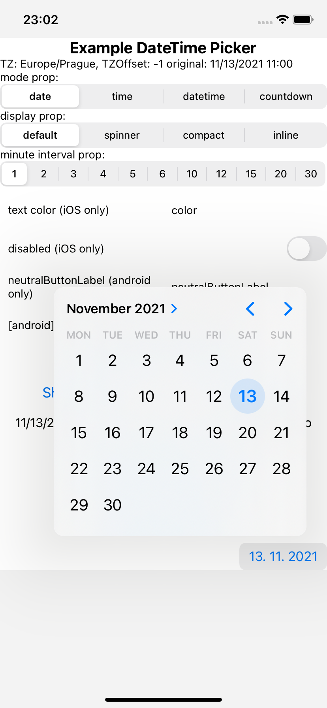
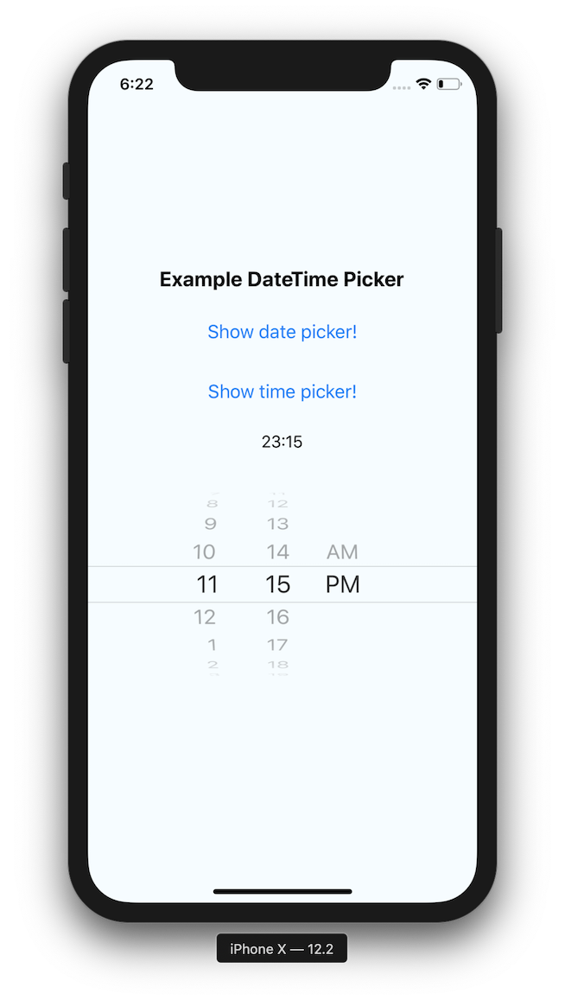
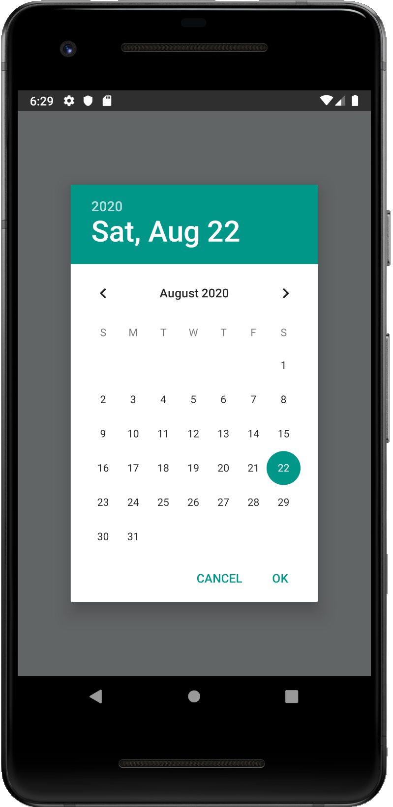
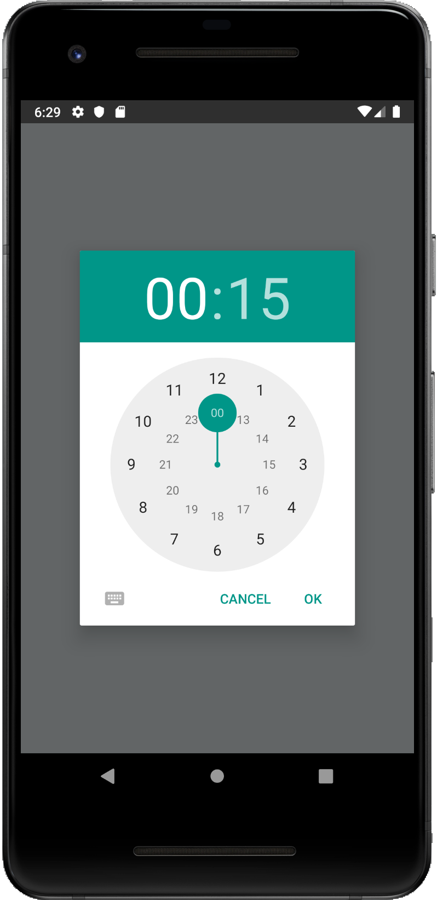
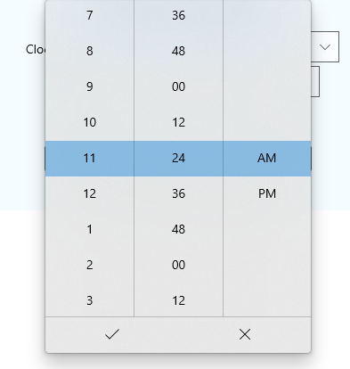
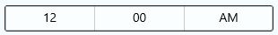

# React Native DateTimePicker

[![CircleCI Status][circle-ci-badge]][circle-ci-status]
![Supports Android and iOS][support-badge]
![MIT License][license-badge]
[![Lean Core Badge][lean-core-badge]][lean-core-issue]

React Native date & time picker component for iOS, Android and Windows.

<table>
  <tr><td colspan=2><strong>iOS</strong></td></tr>
  <tr>
    <td><p align="center"></p></td>
    <td><p align="center"></p></td>
  </tr>
  <tr><td colspan=2><strong>Android</strong></td></tr>
  <tr>
    <td><p align="center"></p></td>
    <td><p align="center"></p></td>
  </tr>
  <tr><td colspan=1><strong>Windows</strong></td></tr>
  <tr>
    <td><p align="center"></p></td>
    <td><p align="center"></p></td>
  </tr>
  <tr>
    <td><p align="center"></p></td>
  </tr>
</table>

## Table of Contents

- [React Native DateTimePicker](#react-native-datetimepicker)
  - [Table of Contents](#table-of-contents)
  - [Expo users notice](#expo-users-notice)
  - [Getting started](#getting-started)
    - [RN >= 0.60](#rn--060)
    - [RN < 0.60](#rn--060-1)
  - [General Usage](#general-usage)
    - [Basic usage with state](#basic-usage-with-state)
  - [Props](#props)
    - [`mode` (`optional`)](#mode-optional)
    - [`display` (`optional`)](#display-optional)
    - [`onChange` (`optional`)](#onchange-optional)
    - [`value` (`required`)](#value-required)
    - [`maximumDate` (`optional`)](#maximumdate-optional)
    - [`minimumDate` (`optional`)](#minimumdate-optional)
    - [`timeZoneOffsetInMinutes` (`optional`, `iOS only`)](#timezoneoffsetinminutes-optional-ios-only)
    - [`timeZoneOffsetInSeconds` (`optional`, `Windows only`)](#timezoneoffsetinsecond-optional-windows-only)
    - [`dayOfWeekFormat` (`optional`, `Windows only`)](#dayOfWeekFormat-optional-windows-only)
    - [`dateFormat` (`optional`, `Windows only`)](#dateFormat-optional-windows-only)
    - [`firstDayOfWeek` (`optional`, `Windows only`)](#firstDayOfWeek-optional-windows-only)
    - [`textColor` (`optional`, `iOS only`)](#textColor-optional-ios-only)
    - [`locale` (`optional`, `iOS only`)](#locale-optional-ios-only)
    - [`is24Hour` (`optional`, `Windows and Android only`)](#is24hour-optional-windows-and-android-only)
    - [`neutralButtonLabel` (`optional`, `Android only`)](#neutralbuttonlabel-optional-android-only)
    - [`minuteInterval` (`optional`)](#minuteinterval-optional)
    - [`style` (`optional`, `iOS only`)](#style-optional-ios-only)
  - [Migration from the older components](#migration-from-the-older-components)
    - [DatePickerIOS](#datepickerios)
    - [DatePickerAndroid](#datepickerandroid)
    - [TimePickerAndroid](#timepickerandroid)
  - [Contributing to the component](#contributing-to-the-component)
  - [Manual installation](#manual-installation)
    - [iOS](#ios)
    - [Android](#android)
    - [Windows](#windows)
  - [Running the example app](#running-the-example-app)

## Requirements

- Xcode >= 11

## Expo users notice

This module is part of Expo - [see docs](https://docs.expo.io/versions/latest/sdk/date-time-picker/). However, Expo SDK may not contain the latest version of the module and therefore, the newest features and bugfixes may not be available in Expo. Use the command `expo install @react-native-community/datetimepicker` (not `yarn` or `npm`) to install this module - Expo will automatically install the latest version compatible with your Expo SDK (which may _not_ be the latest version of the module available).

## Getting started

```bash
npm install @react-native-community/datetimepicker --save
```

or

```bash
yarn add @react-native-community/datetimepicker
```

Autolinking is not yet implemented on Windows, so [Manual installation](#windows) is needed.

#### RN >= 0.60

If you are using RN >= 0.60, only run `npx pod-install`. Then rebuild your project.

#### RN < 0.60

For RN < 0.60, you need to link the dependency using `react-native link`:

```bash
react-native link @react-native-community/datetimepicker
```

Then run `npx pod-install` and rebuild your project.

If this does not work, see [Manual installation](#manual-installation).

## General Usage

```js
import DateTimePicker from '@react-native-community/datetimepicker';
```

or

```js
const DateTimePicker = require('@react-native-community/datetimepicker');
```

### Basic usage with state

```js
import React, {useState} from 'react';
import {View, Button, Platform} from 'react-native';
import DateTimePicker from '@react-native-community/datetimepicker';

export const App = () => {
  const [date, setDate] = useState(new Date(1598051730000));
  const [mode, setMode] = useState('date');
  const [show, setShow] = useState(false);

  const onChange = (event, selectedDate) => {
    const currentDate = selectedDate || date;
    setShow(Platform.OS === 'ios');
    setDate(currentDate);
  };

  const showMode = (currentMode) => {
    setShow(true);
    setMode(currentMode);
  };

  const showDatepicker = () => {
    showMode('date');
  };

  const showTimepicker = () => {
    showMode('time');
  };

  return (
    <View>
      <View>
        <Button onPress={showDatepicker} title="Show date picker!" />
      </View>
      <View>
        <Button onPress={showTimepicker} title="Show time picker!" />
      </View>
      {show && (
        <DateTimePicker
          testID="dateTimePicker"
          value={date}
          mode={mode}
          is24Hour={true}
          display="default"
          onChange={onChange}
        />
      )}
    </View>
  );
};
```

## Props

> Please note that this library currently exposes functionality from [`UIDatePicker`](https://developer.apple.com/documentation/uikit/uidatepicker?language=objc) on iOS and [DatePickerDialog](https://developer.android.com/reference/android/app/DatePickerDialog) + [TimePickerDialog](https://developer.android.com/reference/android/app/TimePickerDialog) on Android, and [`CalendarDatePicker`](https://docs.microsoft.com/en-us/windows/uwp/design/controls-and-patterns/calendar-date-picker) +[TimePicker](https://docs.microsoft.com/en-us/uwp/api/windows.ui.xaml.controls.timepicker?view=winrt-19041) on Windows.
>
> These native classes offer only limited configuration, while there are dozens of possible options you as a developer may need. It follows that if your requirement is not supported by the backing native views, this library will _not_ be able to implement your requirement. When you open an issue with a feature request, please document if (or how) the feature can be implemented using the aforementioned native views. If those views do not support what you need, such feature requests will be closed as not actionable.

#### `mode` (`optional`)

Defines the type of the picker.

List of possible values:

- `"date"` (default for `iOS` and `Android` and `Windows`)
- `"time"`
- `"datetime"` (`iOS` only)
- `"countdown"` (`iOS` only)

```js
<RNDateTimePicker mode="time" />
```

#### `display` (`optional`)

Defines the visual display of the picker. The default value is `"default"`.

List of possible values for Android

- `"default"` - Show a default date picker (spinner/calendar/clock) based on `mode` and Android version.
- `"spinner"`
- `"calendar"` (only for `date` mode)
- `"clock"` (only for `time` mode)

List of possible values for iOS (maps to [preferredDatePickerStyle](https://developer.apple.com/documentation/uikit/uidatepicker/3526124-preferreddatepickerstyle?changes=latest_minor&language=objc))

- `"default"` - Automatically pick the best style available for the current platform & mode.
- `"spinner"` - the usual appearance with a wheel from which you choose values
- `"compact"` - Affects only iOS 14 and later. Will fall back to "spinner" if not supported.
- `"inline"` - Affects only iOS 14 and later. Will fall back to "spinner" if not supported.

```js
<RNDateTimePicker display="spinner" />
```

#### `onChange` (`optional`)

Date change handler.

This is called when the user changes the date or time in the UI. It receives the event and the date as parameters.

```js
setDate = (event, date) => {};

<RNDateTimePicker onChange={this.setDate} />;
```

#### `value` (`required`)

Defines the date or time value used in the component.

```js
<RNDateTimePicker value={new Date()} />
```

#### `maximumDate` (`optional`)

Defines the maximum date that can be selected. Note that on Android, this only works for `date` mode because [TimePicker](https://developer.android.com/reference/android/widget/TimePicker) does not support this.

```js
<RNDateTimePicker maximumDate={new Date(2300, 10, 20)} />
```

#### `minimumDate` (`optional`)

Defines the minimum date that can be selected. Note that on Android, this only works for `date` mode because [TimePicker](https://developer.android.com/reference/android/widget/TimePicker) does not support this.

```js
<RNDateTimePicker minimumDate={new Date(1950, 0, 1)} />
```

#### `timeZoneOffsetInMinutes` (`optional`, `iOS only`)

Allows changing of the timeZone of the date picker. By default it uses the device's time zone.

```js
// GMT+1
<RNDateTimePicker timeZoneOffsetInMinutes={60} />
```

#### `timeZoneOffsetInSeconds` (`optional`, `Windows only`)

Allows changing of the time zone of the date picker. By default it uses the device's time zone.

```js
// UTC+1
<RNDateTimePicker timeZoneOffsetInSeconds={3600} />
```

#### `dayOfWeekFormat` (`optional`, `Windows only`)

Sets the display format for the day of the week headers.
Reference: https://docs.microsoft.com/en-us/uwp/api/windows.ui.xaml.controls.calendarview.dayofweekformat?view=winrt-18362#remarks

```js
<RNDateTimePicker dayOfWeekFormat={'{dayofweek.abbreviated(2)}'} />
```

#### `dateFormat` (`optional`, `Windows only`)

Sets the display format for the date value in the picker's text box.
Reference: https://docs.microsoft.com/en-us/uwp/api/windows.globalization.datetimeformatting.datetimeformatter?view=winrt-18362#examples

```js
<RNDateTimePicker dateFormat="dayofweek day month" />
```

#### `firstDayOfWeek` (`optional`, `Windows only`)

Indicates which day is shown as the first day of the week.

```js
<RNDateTimePicker firstDayOfWeek={DAY_OF_WEEK.Wednesday} />
// The native parameter type is an enum defined in defined https://docs.microsoft.com/en-us/uwp/api/windows.globalization.dayofweek?view=winrt-18362 - meaning an integer needs to passed here (DAY_OF_WEEK).
```

#### `textColor` (`optional`, `iOS only`)

Allows changing of the textColor of the date picker.

```js
<RNDateTimePicker textColor="red" />
```

#### `locale` (`optional`, `iOS only`)

Allows changing of the locale of the component. By default it uses the device's locale.

```js
<RNDateTimePicker locale="es-ES" />
```

#### `is24Hour` (`optional`, `Windows and Android only`)

Allows changing of the time picker to a 24 hour format. By default, this value is decided automatcially based on the user's chosen locale and other preferences.

```js
<RNDateTimePicker is24Hour={true} />
```

#### `neutralButtonLabel` (`optional`, `Android only`)

Allows displaying neutral button on picker dialog.
Pressing button can be observed in onChange handler as `event.type === 'neutralButtonPressed'`

```js
<RNDateTimePicker neutralButtonLabel="clear" />
```

#### `minuteInterval` (`optional`)

The interval at which minutes can be selected.
Possible values are: `1, 2, 3, 4, 5, 6, 10, 12, 15, 20, 30`

(On Windows, this can be any number between 0-59.)

```js
<RNDateTimePicker minuteInterval={10} />
```

#### `style` (`optional`, `iOS only`)

Sets style directly on picker component. By default, the picker height is fixed to 216px.

Please note that by default, picker's text color is controlled by the application theme (light / dark mode). In dark mode, text is white and in light mode, text is black.

This means that eg. if the device has dark mode turned on, and your screen background color is white, you will not see the picker. Please use the `Appearance` api to adjust the picker's background color so that it is visible, as we do in the [example App](/example/App.js) or [opt-out from dark mode](https://stackoverflow.com/a/56546554/2070942).

```js
<RNDateTimePicker style={{flex: 1}} />
```

## Migration from the older components

`RNDateTimePicker` is the new common name used to represent the old versions of iOS and Android.

On Android, open picker modals will update the selected date and/or time if the prop `value` changes. For example, if a HOC holding state, updates the `value` prop. Previously the component used to close the modal and render a new one on consecutive calls.

### DatePickerIOS

- `initialDate` is deprecated, use `value` instead.

  ```js
  // Before
  <DatePickerIOS initialValue={new Date()} />
  ```

  ```js
  // Now
  <RNDateTimePicker value={new Date()} />
  ```

- `date` is deprecated, use `value` instead.

  ```js
  // Before
  <DatePickerIOS date={new Date()} />
  ```

  ```js
  // Now
  <RNDateTimePicker value={new Date()} />
  ```

- `onChange` now returns also the date.

  ```js
  // Before
  onChange = (event) => {};
  <DatePickerIOS onChange={this.onChange} />;
  ```

  ```js
  // Now
  onChange = (event, date) => {};
  <RNDateTimePicker onChange={this.onChange} />;
  ```

- `onDateChange` is deprecated, use `onChange` instead.

  ```js
  // Before
  setDate = (date) => {};
  <DatePickerIOS onDateChange={this.setDate} />;
  ```

  ```js
  // Now
  setDate = (event, date) => {};
  <RNDateTimePicker onChange={this.setDate} />;
  ```

### DatePickerAndroid

- `date` is deprecated, use `value` instead.

  ```js
  // Before
  try {
    const {action, year, month, day} = await DatePickerAndroid.open({
      date: new Date(),
    });
  } catch ({code, message}) {
    console.warn('Cannot open date picker', message);
  }
  ```

  ```js
  // Now
  <RNDateTimePicker mode="date" value={new Date()} />
  ```

- `minDate` and `maxDate` are deprecated, use `minimumDate` and `maximumDate` instead.

  ```js
  // Before
  try {
    const {action, year, month, day} = await DatePickerAndroid.open({
      minDate: new Date(),
      maxDate: new Date(),
    });
  } catch ({code, message}) {
    console.warn('Cannot open date picker', message);
  }
  ```

  ```js
  // Now
  <RNDateTimePicker
    mode="date"
    minimumDate={new Date()}
    maximumDate={new Date()}
  />
  ```

- `dateSetAction` is deprecated, use `onChange` instead.

  ```js
  // Before
  try {
    const {action, year, month, day} = await DatePickerAndroid.open();
    if (action === DatePickerAndroid.dateSetAction) {
      // Selected year, month (0-11), day
    }
  } catch ({code, message}) {
    console.warn('Cannot open date picker', message);
  }
  ```

  ```js
  // Now
  setDate = (event, date) => {
    if (date !== undefined) {
      // timeSetAction
    }
  };
  <RNDateTimePicker mode="date" onChange={this.setDate} />;
  ```

- `dismissedAction` is deprecated, use `onChange` instead.

  ```js
  // Before
  try {
    const {action, year, month, day} = await DatePickerAndroid.open();
    if (action === DatePickerAndroid.dismissedAction) {
      // Dismissed
    }
  } catch ({code, message}) {
    console.warn('Cannot open date picker', message);
  }
  ```

  ```js
  // Now
  setDate = (event, date) => {
    if (date === undefined) {
      // dismissedAction
    }
  };
  <RNDateTimePicker mode="date" onChange={this.setDate} />;
  ```

### TimePickerAndroid

- `hour` and `minute` are deprecated, use `value` instead.

  ```js
  // Before
  try {
    const {action, hour, minute} = await TimePickerAndroid.open({
      hour: 14,
      minute: 0,
      is24Hour: false, // Will display '2 PM'
    });
    if (action !== TimePickerAndroid.dismissedAction) {
      // Selected hour (0-23), minute (0-59)
    }
  } catch ({code, message}) {
    console.warn('Cannot open time picker', message);
  }
  ```

  ```js
  // Now
  // It will use the hour and minute defined in date
  <RNDateTimePicker mode="time" value={new Date()} />
  ```

- `timeSetAction` is deprecated, use `onChange` instead.

  ```js
  // Before
  try {
    const {action, hour, minute} = await TimePickerAndroid.open();
    if (action === TimePickerAndroid.timeSetAction) {
      // Selected hour (0-23), minute (0-59)
    }
  } catch ({code, message}) {
    console.warn('Cannot open time picker', message);
  }
  ```

  ```js
  // Now
  setTime = (event, date) => {
    if (date !== undefined) {
      // Use the hour and minute from the date object
    }
  };
  <RNDateTimePicker mode="time" onChange={this.setTime} />;
  ```

- `dismissedAction` is deprecated, use `onChange` instead.

  ```js
  // Before
  try {
    const {action, hour, minute} = await TimePickerAndroid.open();
    if (action === TimePickerAndroid.dismissedAction) {
      // Dismissed
    }
  } catch ({code, message}) {
    console.warn('Cannot open time picker', message);
  }
  ```

  ```js
  // Now
  setTime = (event, date) => {
    if (date === undefined) {
      // dismissedAction
    }
  };
  <RNDateTimePicker mode="time" onChange={this.setTime} />;
  ```

## Contributing to the component

Please see [CONTRIBUTING.md](CONTRIBUTING.md)

## Manual installation

#### iOS

1. Install CocoaPods, here the [installation guide](https://guides.cocoapods.org/using/getting-started.html).
2. Inside the iOS folder run `pod init`, this will create the initial `pod` file.
3. Update your `pod` file to look like the following ( Remember to replace `MyApp` with your target name ):

   ```ruby
   # Allowed sources
   source 'https://github.com/CocoaPods/Specs.git'

   target 'MyApp' do
     # As we use Swift, ensure that `use_frameworks` is enabled.
     use_frameworks!

     # Specific iOS platform we are targetting
     platform :ios, '8.0'

     # Point to the installed version
     pod 'RNDateTimePicker', :path => '../node_modules/@react-native-community/datetimepicker/RNDateTimePicker.podspec'

     # React/React-Native specific pods
     pod 'React', :path => '../node_modules/react-native', :subspecs => [
       'Core',
       'CxxBridge',      # Include this for RN >= 0.47
       'DevSupport',     # Include this to enable In-App Devmenu if RN >= 0.43
       'RCTText',
       'RCTNetwork',
       'RCTWebSocket',   # Needed for debugging
     ]

     # Explicitly include Yoga if you are using RN >= 0.42.0
     pod 'yoga', :path => '../node_modules/react-native/ReactCommon/yoga'

     # Third party deps podspec link
     pod 'DoubleConversion', :podspec => '../node_modules/react-native/third-party-podspecs/DoubleConversion.podspec'
     pod 'glog', :podspec => '../node_modules/react-native/third-party-podspecs/glog.podspec'
     pod 'Folly', :podspec => '../node_modules/react-native/third-party-podspecs/Folly.podspec'

   end
   ```

4. Run `pod install` inside the same folder where the `pod` file was created
5. `npm run start`
6. `npm run start:ios`

#### Android

1. Add the following lines to `android/settings.gradle`:

   ```gradle
   include ':@react-native-community_datetimepicker'
   project(':@react-native-community_datetimepicker').projectDir = new File(rootProject.projectDir, '../node_modules/@react-native-community/datetimepicker/android')
   ```

2. Add the compile line to the dependencies in `android/app/build.gradle`:

   ```gradle
   dependencies {
       ...
       implementation project(':@react-native-community_datetimepicker')
   }
   ```

3. Add the import and link the package in `MainApplication.java`:

   ```diff
   + import com.reactcommunity.rndatetimepicker.RNDateTimePickerPackage;

   public class MainApplication extends Application implements ReactApplication {

     @Override
     protected List<ReactPackage> getPackages() {
       @SuppressWarnings("UnnecessaryLocalVariable")
       List<ReactPackage> packages = new PackageList(this).getPackages();
       // Packages that cannot be autolinked yet can be added manually here, for example:
   +   packages.add(new RNDateTimePickerPackage());
       return packages;
     }
   }
   ```

#### Windows

##### Add the DateTimePickerWindows project to your solution

1. Open the solution in Visual Studio 2019
2. Right-click solution icon in Solution Explorer > Add > Existing Project
   Select 'D:\pathToYourApp\node_modules\@react-native-community\datetimepicker\windows\DateTimePickerWindows\DateTimePickerWindows.vcxproj'

##### **windows/myapp.sln**

Add a reference to `DateTimePickerWindows` to your main application project. From Visual Studio 2019:

Right-click main application project > Add > Reference...
Check 'DateTimePickerWindows' from the 'Project > Solution' tab on the left.

##### **pch.h**

Add `#include "winrt/DateTimePicker.h"`.

##### **app.cpp**

Add `PackageProviders().Append(winrt::DateTimePicker::ReactPackageProvider());` before `InitializeComponent();`.

## Running the example app

1. Install required pods in `example/ios` by running `npx pod-install`
1. Run `npm start` to start Metro Bundler
1. Run `npm run start:ios` or `npm run start:android` or `npm run start:windows` (or `yarn run start:windows`)

[circle-ci-badge]: https://img.shields.io/circleci/project/github/react-native-community/datetimepicker/master.svg?style=flat-square
[circle-ci-status]: https://circleci.com/gh/react-native-community/workflows/datetimepicker/tree/master
[support-badge]: https://img.shields.io/badge/platforms-android%20|%20ios-lightgrey.svg?style=flat-square
[license-badge]: https://img.shields.io/npm/l/@react-native-community/slider.svg?style=flat-square
[lean-core-badge]: https://img.shields.io/badge/Lean%20Core-Extracted-brightgreen.svg?style=flat-square
[lean-core-issue]: https://github.com/facebook/react-native/issues/23313
