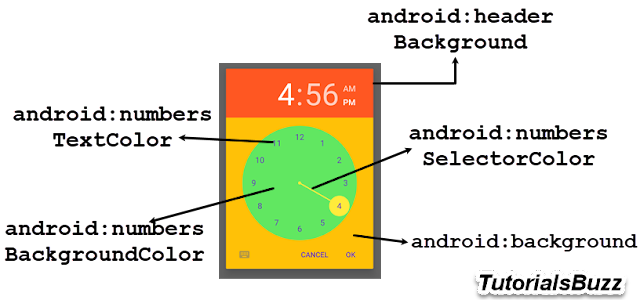

## Android Styling

To use the features documented here, you need to use version >= `8.2.0` and a [Expo Development build](https://docs.expo.dev/develop/development-builds/introduction/).

Make changes as documented below and then run the following commands to see the updated colors:

- `npx expo prebuild -p android --clean` (apply configuration to the native code)
- `expo run:android` (build the native code)

### Configuration in app.json / app.config.js

```json
{
  "expo": {
    "plugins": [
      [
        "@react-native-community/datetimepicker",
        {
          "android": {
            "datePicker": {
              "colorAccent": {
                "light": "#FF5722"
              },
              "textColorPrimary": {
                "light": "#FF5722"
              }
            },
            "timePicker": {
              "background": {"light": "#FF5722", "dark": "#383838"},
              "numbersBackgroundColor": {"light": "#FF5722", "dark": "#383838"}
            }
          }
        }
      ]
    ]
  }
}
```

It's not possible to specify a color only for dark mode. If you wish to influence dark mode color you must declare a value for both the `light` and `dark` modes. Plugin will throw an error otherwise. Plugin also validates that the color names you specify (e.g. `textColorPrimary`) are valid.

### Configurable properties

The following illustrations show the different styles that can be applied to the date and time pickers.

| DatePickerDialog                                                           | TimePickerDialog                                             |
| -------------------------------------------------------------------------- | ------------------------------------------------------------ |
|  |  |

#### DatePickerDialog

| Property                           | Attribute Name                             |
| ---------------------------------- | ------------------------------------------ |
| colorAccent                        | colorAccent                                |
| colorControlActivated              | colorControlActivated                      |
| colorControlHighlight              | colorControlHighlight                      |
| selectableItemBackgroundBorderless | android:selectableItemBackgroundBorderless |
| textColor                          | android:textColor                          |
| textColorPrimary                   | android:textColorPrimary                   |
| textColorPrimaryInverse            | android:textColorPrimaryInverse            |
| textColorSecondary                 | android:textColorSecondary                 |
| textColorSecondaryInverse          | android:textColorSecondaryInverse          |
| windowBackground                   | android:windowBackground                   |

#### TimePickerDialog

| Property               | Attribute Name                 |
| ---------------------- | ------------------------------ |
| background             | android:background             |
| headerBackground       | android:headerBackground       |
| numbersBackgroundColor | android:numbersBackgroundColor |
| numbersSelectorColor   | android:numbersSelectorColor   |
| numbersTextColor       | android:numbersTextColor       |
